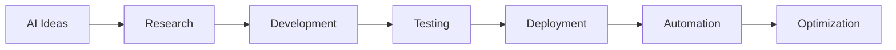

<div align="center">


<br>


<br><br>


</div>

---

#  About Me

<table>
<tr>
<td width="52%">

```yaml
name: Moiz Khan

role: AI Engineer & Automation Developer

located_in: Pakistan

specialization:
  [
    "Agentic AI",
    "Automation Systems",
    "Computer Vision",
    "AI Web Applications",
    "Deep Learning"
  ]

currently_learning:
  [
    "AI Agents",
    "Production AI Systems",
    "Cloud Infrastructure",
    "Advanced Automations"
  ]

tech_interests:
  [
    "FastAPI",
    "LangChain",
    "React",
    "Docker",
    "TensorFlow",
    "PyTorch"
  ]

creative_side:
  [
    "Photography",
    "Videography",
    "Video Editing"
  ]

goal:
  "Building intelligent AI-powered products
   that solve real-world problems."
```

</td>

<td width="48%">


</td>
</tr>
</table>

---

#  Tech Arsenal

<div align="center">

### 🤖 Artificial Intelligence & Machine Learning


<br><br>


---

### ⚙️ Backend • APIs • Automation


<br><br>


---

### 🌐 Frontend & Development


</div>

---

# 🚀 Featured Projects

<div align="center">

<table>
<tr>
<td width="50%">

## 🤖 AI Booking Assistant

### Intelligent conversational booking system

✔ FastAPI Backend  
✔ LangChain Integration  
✔ OpenAI APIs  
✔ FAISS Memory  
✔ Smart User Interaction  
✔ AI Information Extraction  

</td>

<td width="50%">

## 🩺 Medical Diagnosis AI

### CNN-based healthcare intelligence

✔ Medical Image Classification  
✔ Deep Learning Models  
✔ X-Ray Analysis  
✔ TensorFlow & PyTorch  
✔ Computer Vision Techniques  

</td>
</tr>

<tr>
<td width="50%">

## ⚡ AI Automation Workflows

### Smart business process automation

✔ n8n Automations  
✔ API Integrations  
✔ AI Agents  
✔ Database Workflows  
✔ Automated Pipelines  

</td>

<td width="50%">

## 🌐 Full Stack AI Applications

### Production-ready intelligent systems

✔ React Frontend  
✔ FastAPI Backend  
✔ Firebase Integration  
✔ Docker Deployment  
✔ Interactive UI/UX  

</td>
</tr>
</table>

</div>

---

#  Development Activity

<div align="center">


</div>

<br>

<div align="center">


</div>

---

# 🧠 AI Focus Areas

<div align="center">

| Domain | Technologies |
|---|---|
| 🤖 AI Engineering | TensorFlow, PyTorch, Scikit-learn |
| 🧠 LLM Applications | LangChain, OpenAI APIs |
| ⚡ Automation | n8n, APIs, Workflow Systems |
| 👁 Computer Vision | CNNs, OpenCV, Deep Learning |
| 🌐 Full Stack | React, FastAPI, Firebase |
| ☁ Deployment | Docker, AWS |

</div>

---

# 🌌 Contribution Snake

<div align="center">


</div>

---

# 🌐 Connect With Me

<div align="center">

<a href="https://github.com/Moiz1Khan">

</a>

<a href="https://linkedin.com">

</a>

<a href="mailto:yourmail@gmail.com">

</a>

<a href="https://portfolio.com">

</a>

</div>

---

# ⚡ Current AI Workflow

<div align="center">



</div>

---

<div align="center">

### 💡 “Building intelligent systems that combine creativity, automation, and AI.”

<br>


</div>
